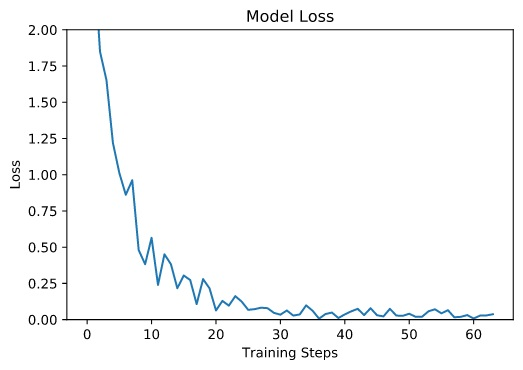
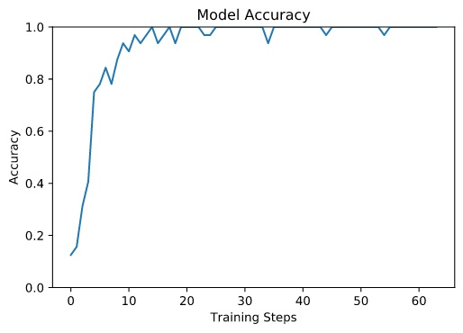
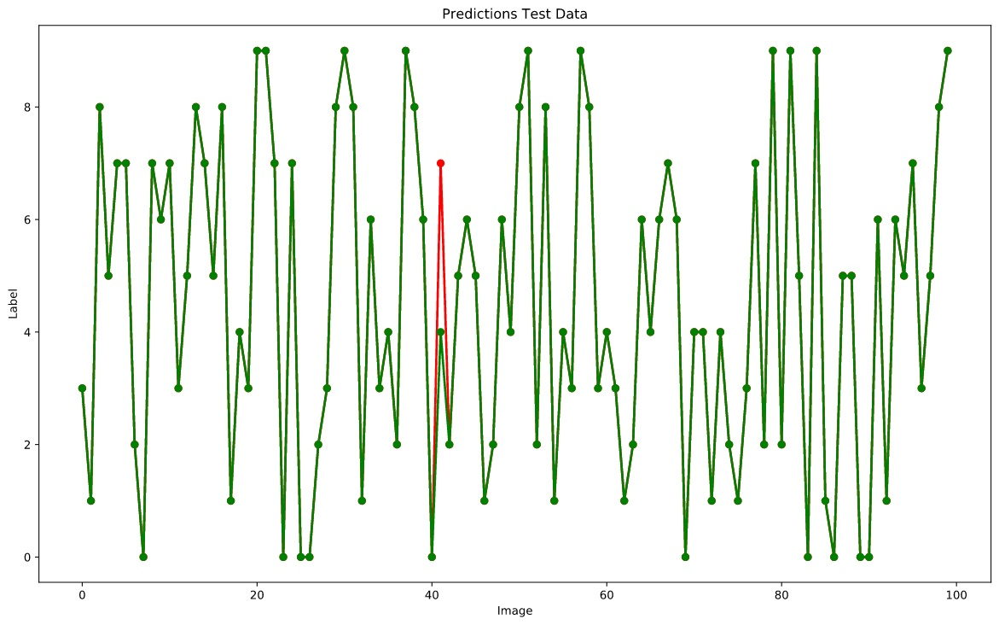
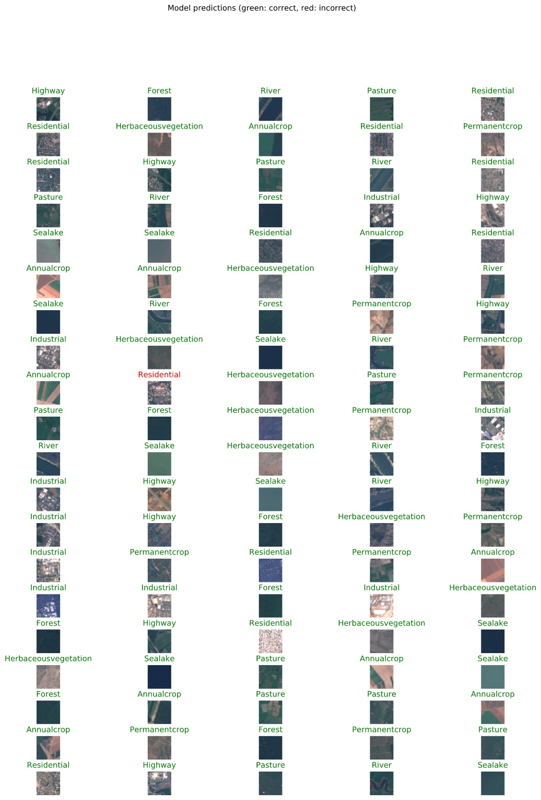

#

Klassifikation von Satellitenbildern mit TensorFlow
===================================================

## Inhalt
* [Einleitung](#einleitung)
* [Import EuroSat RGB Dataset](#import-eurosat-rgb-dataset)
* [Import Convolutional Neural Network in Model](#import-convolutional-neural-network-in-model)
* [Verifizieren anhand der Testdaten](#verifizieren-anhand-der-testdaten)
* [Summary](#summary)


## Einleitung
In diesem Beitrag wollen wir uns mit der Klassifikation von Images beschäftigen und werden dazu Sentinel-2 Satellitenbilder nutzen. Dazu downloaden wir das gelabelte [EuroSat RGB Dataset](https://www.tensorflow.org/datasets/catalog/eurosat) von folgendem [gitHub Repository](https://github.com/phelber/eurosat#Download).

Zur Lösung unseres Klassifikationsproblems werden wir ein neuronales Netz verwenden und dabei auf die TensorFlow Python API zugreifen. Um neuronale Netze zu trainieren, sind sehr viele Bilder erforderlich. Unsere 27.000 Sentinel-2 Satellitenbilder reichen dafür bei weitem nicht aus. Deshalb verwenden wir das vortrainierte Convolutional Neural Network (CNN) Model [EuroSat ResNet-50](https://tfhub.dev/google/remote_sensing/eurosat-resnet50/1) von Google, das wir uns vom TensorFlow Hub herunterladen.

Ich habe mich im Folgenden u.a. vom Tutorial [Transfer learning with TensorFlow Hub](https://www.tensorflow.org/tutorials/images/transfer_learning_with_hub) inspirieren lassen und Code daraus wiederverwendet.

Der gesamte Quellcode ist in einem Jupyter Notebook [IPYNB-File](src/pub_eurosat_3.ipynb) gespeichert.


## Import EuroSat RGB Dataset
Zunächst importieren wir die benötigten Python packages.
```
from __future__ import absolute_import, division, print_function, unicode_literals

import numpy as np
import matplotlib.pylab as plt
import PIL.Image as Image
import tensorflow as tf
from tensorflow.keras import layers
import tensorflow_hub as hub
```
Dann laden wir die Daten mit einem Keras ImageDataGenerator. Allerdings begnügen wir uns mit einer kleinen Stichprobe aus den 27.000 Satellitenbildern *(Train: 1.000, Validation: 100, Test: 100)*. 
```
train_path = r'C:\openSource\EuroSAT\part'
val_path = r'C:\openSource\EuroSAT\part_validation'
test_path = r'C:\openSource\EuroSAT\part_test'
IMAGE_SHAPE = (224, 224)

image_generator = tf.keras.preprocessing.image.ImageDataGenerator(rescale=1/255)
train_data = image_generator.flow_from_directory(str(train_path), target_size=IMAGE_SHAPE)
val_data = image_generator.flow_from_directory(str(val_path), target_size=IMAGE_SHAPE)
test_data = image_generator.flow_from_directory(str(test_path), target_size=IMAGE_SHAPE)
```
Speichern die Namen der 10 Klassen in einem NumPy Array.
```
class_names = sorted(train_data.class_indices.items(), key=lambda pair:pair[1])
class_names = np.array([key.title() for key, value in class_names])
print('Labels:', class_names)
```
Um uns die Struktur des Image-Arrays *(32, 224, 224, 3)* sowie des Label-Arrays *(32, 10)* anzusehen, holen wir uns mit einem DirectoryIterator beispielhaft den ersten Batch für die Validierungsdaten. Die Batchgröße beträgt per Default 32. Für Image Height x Width werden von Google 224 x 224 Pixels für das vortrainierte Modell empfohlen. Und wir haben 3 Bänder (RGB). Aus dem Label Shape sehen wir, das die Daten auf 10 Klassen verteilt sind.
```
val_batch, val_label = next(val_data)

print("Image batch shape: ", val_batch.shape)
print("Label batch shape:", val_label.shape)
print("Number of batch:", val_data.__len__())
```


## Import Convolutional Neural Network in Model
Nun importieren wir uns das von Google vortrainierte EuroSat ResNet-50 Modell in einen Keras Layer und sorgen dafür, dass dieser Layer nicht trainiert werden kann.
```
classifier_url = r'C:\openSource\EuroSAT\model_resNet-50'

classifier = hub.KerasLayer(classifier_url, input_shape=IMAGE_SHAPE+(3,))
classifier.trainable = False

feature_batch = classifier(val_batch)
print('Feature batch shape:', feature_batch.shape)
```
Erzeugen ein neues Keras Sequential Modell und fügen den Keras Layer als unterste Schicht ein. Diese Schicht ist bereits trainiert, sie hat Merkmale allgemeiner Struktur erlernt und erspart uns riesige Rechenkapazität. Diese Schicht hat einen Shape von (,2048), d.h. sie gibt 2.048 Features aus. Anhand dieser Feature-Values muss nun noch eine Zuordnung zu unseren 10 Klassen erlernt werden. Dazu fügen wir in das Modell, mit einem Keras Dense Layer, eine weitere Schicht ein. Diese Klassifizierungs-Schicht hat einen Shape von (,10), d.h. sie gibt 10 Features aus, die hier unseren 10 Klassen entsprechen. Ein Image wird letztendlich der Klasse mit dem größten Feature-Value zugeordnet. Werfen wir noch einen kurzen Blick auf die Modellzusammenfassung. Dort sehen wir, dass nur die 20.490 Parameter der zweiten Schicht trainierbar sind, während die 23,5 Mio. Parameter der ersten Schicht fix sind.
```
model = tf.keras.Sequential([
  classifier,
  layers.Dense(train_data.num_classes)
])

model.summary()
```
Jetzt kompilieren wir das Modell.
```
model.compile(
  optimizer=tf.keras.optimizers.Adam(),
  loss=tf.keras.losses.CategoricalCrossentropy(from_logits=True),
  metrics=['acc'])
```
Evaluieren die Validierungs-Daten vor dem Modell-Training *(initial loss: 2.64, initial accuracy: 0.12)*.
```
loss0, accuracy0 = model.evaluate(val_data)
print("initial loss: {:.2f}".format(loss0))
print("initial accuracy: {:.2f}".format(accuracy0))
```
Fügen die Callback-Klasse 'CollectBatchStats' ein.
```
class CollectBatchStats(tf.keras.callbacks.Callback):
  def __init__(self):
    self.batch_losses = []
    self.batch_acc = []

  def on_train_batch_end(self, batch, logs=None):
    self.batch_losses.append(logs['loss'])
    self.batch_acc.append(logs['acc'])
    self.model.reset_metrics()
```
Und trainieren unser Modell in 2 Epochen mit je 32 Steps. Die Trefferquote für die Trainings-Daten liegt bei 100%. Trotz der sehr kleinen Stichprobe, die wir für das Training verwendet haben, liegt die Trefferquote für die Validierungs-Daten ebenfalls bei 100% *(loss: 0.03, accuracy: 1.00)*. Trainiert man das Modell von Grund auf neu, dann stellt man fest, dass diese Maße schwanken. Das liegt daran, dass alle Neuronen mit einem zufälligen Anfangsgewicht starten. Das Netz lernt also jedes Mal etwas anders. Nach dem Training werden Bias und Gewichte gespeichert, so dass das Netz auf dieser Basis nachtrainiert werden kann.  Je häufiger man das Netz trainiert, desto höher wird die Präzision. Allerdings steigt damit auch die Wahrscheinlichkeit für ein Overfitting, d.h. das Modell wird zu exakt auf die Trainingsdaten zugeschnitten.
```
steps_per_epoch = np.ceil(train_data.samples/train_data.batch_size)
batch_stats_callback = CollectBatchStats()

history = model.fit_generator(train_data, epochs=2,
                              steps_per_epoch=steps_per_epoch,
                              callbacks = [batch_stats_callback],
                              validation_data=val_data)
```
```
val_loss, val_acc = model.evaluate(val_data)
print("val loss: {:.2f}".format(val_loss))
print("val accuracy: {:.2f}".format(val_acc))
```
Die Entwicklung von Loss und Accuracy für die Trainingsdaten plotten wir jeweils in einem Liniendiagramm.
```
plt.figure()
plt.title('Model Loss')
plt.ylabel("Loss")
plt.xlabel("Training Steps")
plt.ylim([0,2])
plt.plot(batch_stats_callback.batch_losses)
plt.show()
```

```
plt.figure()
plt.title('Model Accuracy')
plt.ylabel("Accuracy")
plt.xlabel("Training Steps")
plt.ylim([0,1])
plt.plot(batch_stats_callback.batch_acc)
plt.show()
```



## Verifizieren anhand der Testdaten
Kommen wir zum dritten Image-Paket, das wir eingelesen haben. Zu Bildern, mit denen das Modell bisher nicht in Kontakt gekommen ist. Eine Evaluation ergibt für die Test-Daten eine Trefferquote von 99% *(loss: 0.05, accuracy: 0.99)*.
```
test_loss, test_acc = model.evaluate(test_data)
print("test loss: {:.2f}".format(test_loss))
print("test accuracy: {:.2f}".format(test_acc))
```
Jetzt schauen wir uns die Klassifizierung der Test-Daten im Detail an. Dazu verpacken wir die 4 Batches in NumPy Arrays.
```
test_pred = None
test_true = None
batch = None
names_pred = None
batch_len = test_data.__len__()

for b in range(batch_len):
    test_batch, test_label = next(test_data)

    predicted_batch = model.predict(test_batch)
    predicted_id = np.argmax(predicted_batch, axis=-1)
    predicted_label = class_names[predicted_id]
    label_id = np.argmax(test_label, axis=-1)
    
    if b>0:
        test_pred = np.concatenate((test_pred, predicted_id), axis=0)
        test_true = np.concatenate((test_true, label_id), axis=0)
        batch = np.concatenate((batch, test_batch), axis=0)
        names_pred = np.concatenate((names_pred, predicted_label), axis=0)
    else:
        test_pred = predicted_id
        test_true = label_id
        batch = test_batch
        names_pred = predicted_label
```
Und plotten die vorhergesagten und die tatsächlichen Labels in einem Liniendiagramm. Hier ist gut zu erkennen, dass von den 100 Test-Bildern nur eins falsch klassifiziert wurde.
```
plt.figure(figsize=(15,9))
plt.title('Predictions Test Data')
plt.plot(test_pred, color='red', marker='o', linewidth=2, markersize=6)
plt.plot(test_true, color='green', marker='o', linewidth=2, markersize=6)
plt.xlabel('Image')
plt.ylabel('Label')
plt.show()
```


Welches Images das ist, das finden wir so heraus.
```
plt.figure(figsize=(15,20))
plt.subplots_adjust(hspace=0.5)
for n in range(100):
  plt.subplot(20,5,n+1)
  plt.imshow(batch[n])
  color = "green" if test_pred[n] == test_true[n] else "red"
  plt.title(names_pred[n].title(), color=color)
  plt.axis('off')
_ = plt.suptitle("Model predictions (green: correct, red: incorrect)")
```


Zum Abschluss speichern wir unser trainiertes Modell als Tensorflow SavedModel auf die Festplatte. Damit haben wir die CPU genug gequält.
```
save_dir = r'D:\ML_Image\saved_model\MyEuroSat'
model.save(save_dir, save_format='tf')
```


## Summary
In den vorhergehenden Kapiteln haben wir am Thema künstliche neuronale Netze geschnuppert und uns etwas mit der sehr mächtigen TensorFlow Python API vertraut gemacht. Ich persönlich finde es Wahnsinn, was Google u.a. in diesem Bereich leisten. Trotzdem ist die Menschheit noch meilenweit von echter künstlicher Intelligenz entfernt. Geht man von der Entwicklung der letzten hundert Jahre aus, wird ihr auch dies irgendwann gelingen bzw. 'miss-gelingen'. Denn es wird Folgen haben.  
